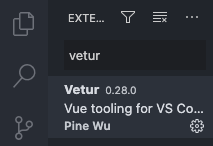
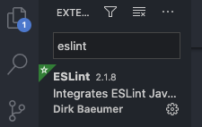

# Cara Install Visual Studio Code

1. buka terminal

2. install vscode melalui brew
    >$brew cask install visual-studio-code
    

3. install extension vetur untuk tools vuejs
    * klik button extension, lalu search extension "Vetur"
    * klik install

    

4. install extension eslint untuk standarisasi code javascript
    * klik button extension, lalu search extension "eslint"
    * klik install

    